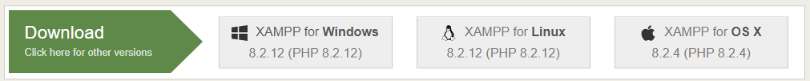

# Upload Image

**Initial version (2025-06-14)**

---

## 1. Download the Code

Download the source code from the following GitHub link:

- https://github.com/MichaelY223/upload-image/archive/refs/tags/v0.1.0.zip

This ZIP file contains:

- `upload_image.php`
- `get_image_info.py`
- `.gitignore` (not necessary for local testing)

---

## 2. Set Up a Localhost Testing Environment for PHP

### a. Download and Install XAMPP

1. Visit the official XAMPP website:  
   https://www.apachefriends.org/

2. Select the version appropriate for your operating system (Windows, Linux, or macOS).

   

3. Run the installer and follow the installation wizard.
   - You can leave all settings at their defaults.
   - Choose the default installation location (`C:\xampp` on Windows).

---

### b. Prepare the Project Files

1. Open the XAMPP installation directory and navigate to:  
   `C:\xampp\htdocs\`

2. Inside `htdocs`, create a new folder. You can name it anything (e.g., `upload_project`).  
   _This folder name will be used in the browser URL later._

3. Copy the following files from the downloaded ZIP file from the first step into the folder you just created:
   - `upload_image.php`
   - `get_image_info.py`

---

### c. Start Apache Server

1. Navigate to the root XAMPP installation directory (`C:\xampp`) and locate `xampp-control.exe`.
2. Double-click to open the **XAMPP Control Panel**.
3. In the control panel, click **Start** next to **Apache** to start the web server.

   

---

### d. Access the PHP Script in a Browser

- Open any web browser and go to: http://localhost/[your-folder-name]/upload_image.php
- Replace <code>[your-folder-name]</code> with the actual name you chose earlier.
- For example: `http://localhost/upload_project/upload_image.php`

---

## Notes

- `get_image_info.py` is a python script and is being executed from `upload_image`.php.
  - This means python must be installed on your system
- Open command prompt and type `python --version` to check if python is installed
  - If this returns something like `Python 3.13.5`, python is correctly installed
  - If it returns: `'python' is not recognized as an internal or external command`, python is not installed
- To install python, visit: https://www.python.org/ and follow the default download instructions for the latest version for your operating system
