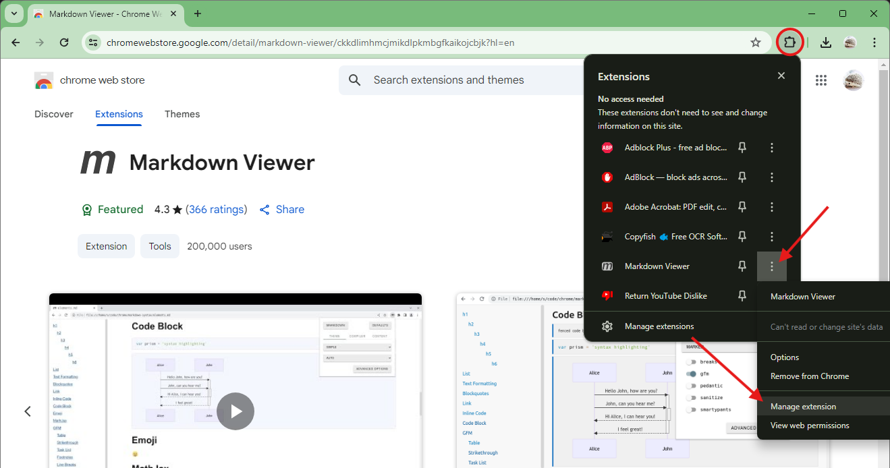
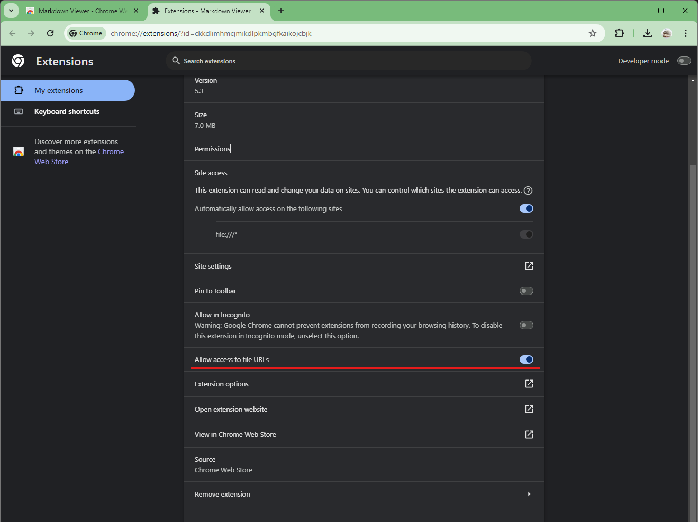
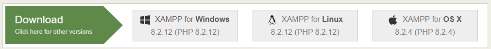
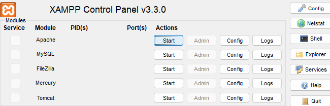
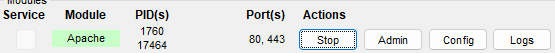

# Upload Image

**Initial version (2025-06-14)**

---

## 1. Source Code Location

After extracting the ZIP archive, you'll find the following files in the root directory:

- `upload_image.php`
- `get_image_info.py`
- `.gitignore` (can be ignored for local testing)
- `README.md` (this file)
- `docs/` (contains images used in README for instructions)

---

## 2. Open README.md

If you are reading this file as a plain text document in notepad or a browser, a simple chrome extension (Markdown Viewer - installation instructions below) can be installed to greatly improve readibility and formatting. Without the extension, images will not appear either. Or, if VS Code is already installed, it can be viewed there by opening the README in VS Code and pressing `Ctrl`+`Shift`+`V`.

### a. Markdown Viewer installation and configuration for Chrome

- Go to: https://chromewebstore.google.com/detail/markdown-viewer/ckkdlimhmcjmikdlpkmbgfkaikojcbjk?hl=en
- Click `Add to chrome`
- After adding, click the puzzle piece in the top right corner of the browser, find Markdown Viewer in extensions list, and click the 3 dots next to it. Then click manage extensions; As shown in the image below:
  

- In the manage extensions page, scroll down to find "Allow access to file URLs" and enable it; As shown in the image below:
  

- Then, re-open this file in Chrome

## 2. Set Up a Localhost Testing Environment for PHP

### a. Download and Install XAMPP

1. Visit the official XAMPP website:  
   https://www.apachefriends.org/

2. Select the version appropriate for your operating system (Windows, Linux, or macOS).

   

3. Run the installer and follow the installation wizard.
   - You can leave all settings at their defaults.
   - Choose the default installation location (`C:\xampp` on Windows).

---

### b. Prepare the Project Files

1. Open the XAMPP installation directory and navigate to:  
   `C:\xampp\htdocs\`

2. Inside `htdocs`, create a new folder. You can name it anything (e.g., `upload_project`).  
   _This folder name will be used in the browser URL later._

3. Copy the following files from the downloaded ZIP into the folder you just created:
   - `upload_image.php`
   - `get_image_info.py`

---

## Python installation

- To use this app, python must be installed on your system.
- To check if Python is installed, open Command Prompt and type: `python --version`
  - If it returns something like `Python 3.13.5`, Python is correctly installed.
  - If it returns `'python' is not recognized as an internal or external command`, Python is not installed.
- To install Python, visit: https://www.python.org/; Make sure to check the box that says “Add to PATH” during installation, and follow the default installation instructions for your operating system.

- After installing python or if python was already installed, open Command Propmt and type `python --version` to double check python was installed correctly
  - Then run `pip install pillow` to install the pillow package

---

## Start Apache Server

1. Navigate to the root XAMPP installation directory (`C:\xampp`) and locate `xampp-control.exe`.
2. Double-click to open the **XAMPP Control Panel**.
3. In the control panel, click **Start** next to **Apache** to start the web server.

   

4. After starting, the local server will continue running even after closing XAMPP Control panel. Click `stop` to stop the server.

---

### a. Access the PHP Script in a Browser

- Open any web browser and go to: `http://localhost/<your-folder-name>/upload_image.php`
- Replace `<your-folder-name>` with the actual name you chose earlier.
- For example: `http://localhost/upload_project/upload_image.php`

- Common Issues:
  - Upon visiting the link above, if you see 'This site can’t be reachedlocalhost refused to connect.', check that the Apache server started correctly. Apache should be highlighted green as shown below:
    - 
  - If the box that appears after clicking process image button does not show image details and instead shows a python error, check that both python and the pillow library have been installed.
